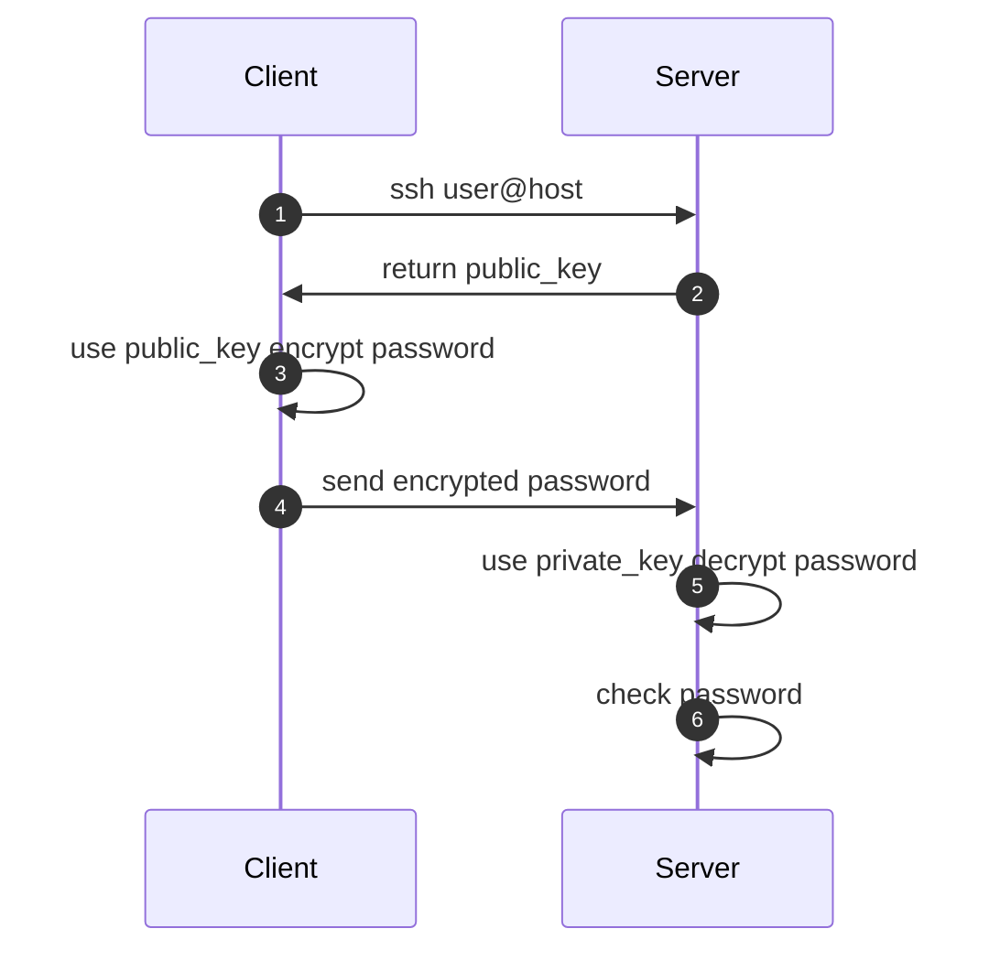
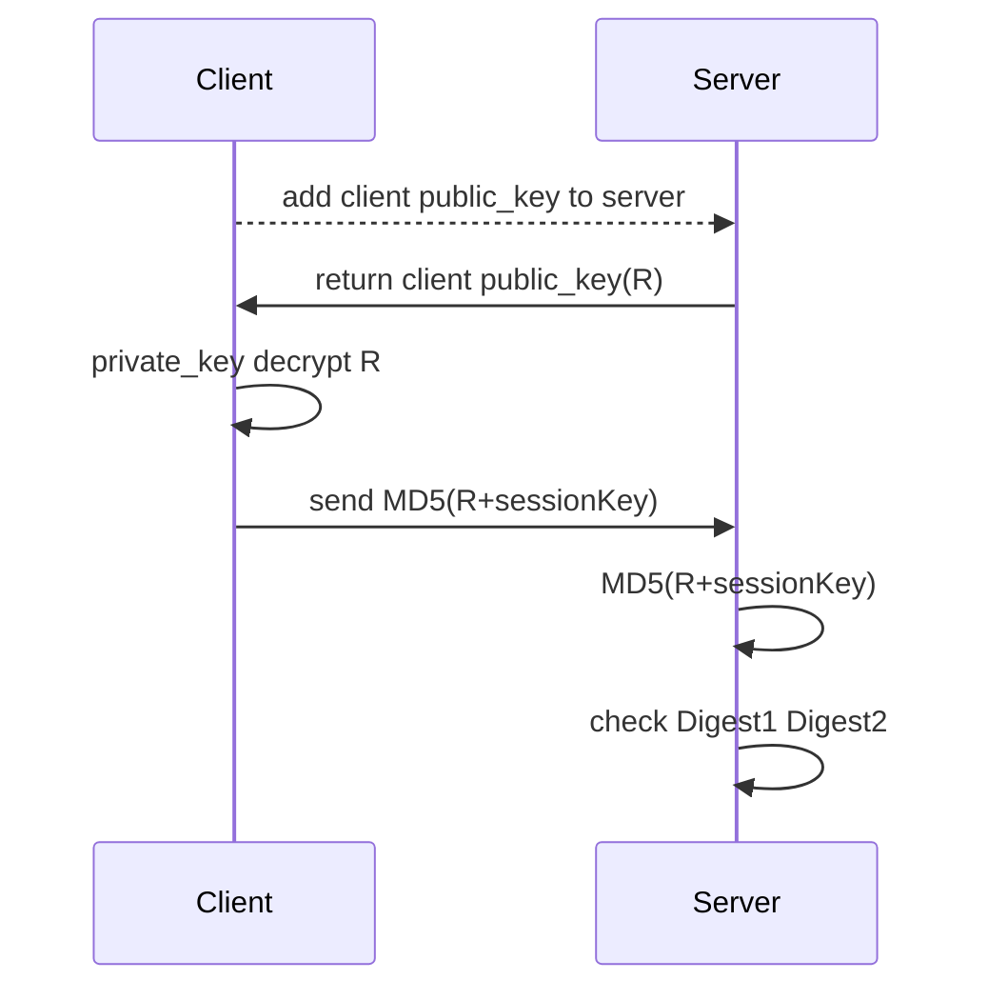

 做后端开发经常遇到一个情况是使用公司的虚拟机很多，每次都要记住用户名密码和IP是一件很麻烦的事情，所以在想有没有一种能够免密快速ssh的方式？

### 什么是SSH

简单来说SSH 是一种网络协议，用于计算机之间的加密登录，早起的互联网通信都是明文通信的，一旦被截获密码就泄露出去了。于是就有了SSH协议，将登录信息全部加密。目前SSH协议已经在全世界广泛使用了，且成为各个L inux发行版本的标配。（桌面版本的Linux不支持SSH，需要安装OpenSSH）

### SSH的过程

SSH 默认使用的是RSA加密算法

1. 请求主机Client用户使用`ssh user@host`命令对远程Server发起登录
2. 远程主机将自己的公钥返回给请求主机
3. 请求主机使用公钥对用户输入的密码进行加密
4. 请求主机将加密后的信息发送给远程主机
5. 远程主机使用私钥对密码进行解密
6. 最后，远程主机判断解密后的密码是否与用户密码一致，一致就同意登陆，否则反之



整个过程看上去没啥问题，但是相比HTTPS 协议安全性是稍差的，那是因为SSH协议没用CA证书签发机构，很容利用自签的证书来截获请求冒充远程主机来取得登录密码的。SSH发现这个问题之后，想了一个办法来绕开这个问题。引入了know_hosts。

### know_hosts作用

在第一次ssh的时候我们都会看到这样的一个提示

```shell
The authenticity of host '10.122.48.130 (10.122.48.130)' can't be established.
RSA key fingerprint is ee:6e:68:7d:91:8c:d8:d9:1d:ab:61:9b:5f:53:68:d3.
Are you sure you want to continue connecting (yes/no)? yes
Warning: Permanently added '10.122.48.130' (RSA) to the list of known hosts.
```

这句话提示的是：无法确认主机的真实性，只知道它的公钥指纹，是否建立连接？这个方式就将主机被冒充的风险抛给了使用者。当然对公钥的核对也是一个问题，这就需要远程主机公开公钥。在上面的提示中输入`yes`之后，s sh就会将远程主机的公钥写入本地的know_hosts文件中。第二次ssh的时候就会核对这个公钥指纹，如果不一致则无法ssh 成功。

具体的know_hosts内容样例，IP 加密算法 指纹信息

```shell
10.122.48.130 ssh-rsa AAAAB3NzaC1yc2EAAAABIwAAAQEA6G4lMkyH4O2IcWxRmbecn6aMTi3r3+eS2W05CLT7zl3EgWyx7nYEXzWeGl7OMhW+OBDsukuMCOApcG+ge4EaQEqVEWAFn+/Dr5HwUyFFTeEj/fP/3/Xq6/3rt277iJHHSyXsWW29+e2w3OjB/eJJ20lJ4nC7fdghZw4AFSP5YVwhXPtTs2I2cX5ziP4guvpNJPCQq/DNt1uZvvsEt7jmQW8K6YixcHNTipKvhAZGZlx/soamu60WAMr8nmhLy4Svc56rLZYTYIkIvZqRzSDfqDCo9/NcOh2oaa1LBUJBD3hZ9F7lpxnfS6tpHEnowGb1wQtdFhLfJ7gGvTzGeAFRow==
```

之前遇到过这样的一个问题，以前已经添加了know_hosts的IP，发现远程主机指纹变化了，导致无法ssh，这时需要将对应IP的这样一行删除即可。主机指纹变化有可能是系统重装，也有可能是IP被其他机器获取了。

Know_hosts文件是在没用用户下的`～/.ssh/know_hosts`

### 别名免密登录

#### 免密登录的公钥认证过程

1. 请求机Client将自己的公钥存储在远程机Server的authorized_keys中
2. 远程机在收到请求机的请求后，会在 authorized_keys 中匹配到 Client 的公钥 pubKey，并生成随机数 R，用 Client 的公钥对该随机数进行加密得到 pubKey(R)，然后将加密后信息发送给 Client。
3. Client 端通过私钥进行解密得到随机数 R，然后对随机数 R 和本次会话的 SessionKey 利用 MD5 生成摘要 Digest1，发送给 Server 端。
4. Server 端会也会对 R 和 SessionKey 利用同样摘要算法生成 Digest2。
5. Server 端会最后比较 Digest1 和 Digest2 是否相同，完成认证过程。



#### ssh 免密登录应用

1. 请求端Client生成自己的公私钥

   ```shell
   # 如果不想设置指定信息，一路回车即可
   ssh-keygen
   ```

   可以在请求端Client的当前用户目录下的.ssh文件下看到id_rsa 和id_rsa.pub文件

2. 将自己的公钥添加到远程主机Server上

   ```shell
   ssh-copy-id -i ~/.ssh/id_rsa.pub user@host
   ```

   在远处主机的用户目录下的.ssh 下有authorized_keys文件

3. 在上面两步完成后已经可以进行免密登录了，但是还是需要指定用户和IP。想要添加别名登录的话，需要在请求端Client的～/.ssh下创建config文件。config文件配置如下

   ```shell
   # 服务器1
   Host 130
       HostName 10.122.48.130
       Port 22
       User root
       IdentityFile /home/test/.ssh/id_rsa
       
   # 服务器2
   Host 131
       HostName 10.122.48.131
       Port 22
       User root
       IdentityFile /home/test/.ssh/id_rsa
   ```

   在请求端Client上执行 `ssh 130`相当于执行`ssh root@10.122.48.130`并且不需要密码。

### AutoSSH 

ssh的反向穿透技术，可以实现内网服务在公网上提供服务。ssh一般用来客户端远程登录到服务器上，而ssh反向穿透“反其道而行之”，由服务端主动发起请求连接客户端，然后在客户端打开一个端口，之后发往客户端的数据包将会转发到服务端。但是ssh不支持自动重连功能，这时我们就可以用上autossh了。

我们可以利用autossh将内网端口映射到外网上。由于autossh 并不是Linux自带的，所以需要自己编译安装。

在内网机器B上进行编译安装

```shell
#1.将autossh下载到服务器B上
wget http://fossies.org/Linux/privat/autossh-1.4e.tgz
#2.解压
tar xzvf autossh-1.4e.tgz
#3. 编译安装
 cd autossh-1.4e
 ./configure
 make
 make install
```

将内网机器B的公钥添加到公网机器A上

```shell
# 如果没生成过公钥执行生成公钥
ssh-keygen
# 将内网机器B的公钥添加到公网机器上
ssh-copy-id -i ~/.ssh/id_rsa.pub user@hostA
```

在内网机器使用autossh

```shell
autossh -M 10000 -NR 9200:localhost:9200 -i ~/.ssh/id_rsa use@hostA
```

参数说明：-M 参数指定监听这个反向链接的端口，如果断了会自动重连

后面的两个9200端口分别是指定公网上暴露的端口后内网暴露的端口

到了这个整个工作就完成了，这时访问公网IP的9200端口，就会访问内网中9200端口的服务。