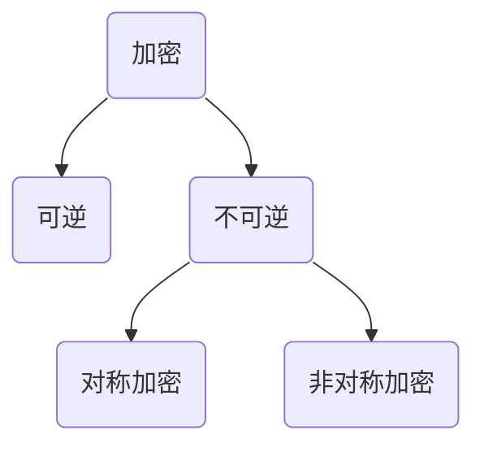

### 简介

先用一张图从大方向来介绍加密分类。当然更加详细的加密算法需要更深入的去学习，本篇主要是对加密算法有个大概的认知，能够认识到不同加密算法的优劣。

### 不可逆的加密算法

#### 单向加密

通过名称我们就可以了解到，就是明文经过加密之后，`无法通过解密`手段解析出加密之前到明文。既然无法解密得出明文，那该加密算法有什么应用场景呢？

不能逆加密算法的应用场景主要是防止信息被篡改，可以明确消息在传递过程中没有被第三方篡改。典型的不可逆加密算法有MD5、SHA、HMAC、SM3等

##### 不可逆特点

1. 压缩性：任意长度明文信息经过加密之后得到长度都是固定的。
2. 抗修改性：对原数据进行任何改动，哪怕是修改一个字节，得到结果都有很大的区别。
3. 弱抗碰撞性：已知原数据和其单向加密结果，想找到一个具有相同结果的数据（即伪造数据）是非常困难的。
4. 强抗碰撞性：想找到两个不同的数据，使它们具有相同的单向加密结果，是非常困难的。
5. 简单高效：对数据进行单向加密处理速度是很快的。

特点整理自[移动端加解密总结](https://zhuanlan.zhihu.com/p/22670078)

### 可逆的加密算法

可逆的加密算法就是明文经过加密之后，`可以通过解密`手段解析出加密之前得到明文。可逆的加密算法又分为对称加密和非对称加密。

#### 对称加密

对称加密算法，就是加密和解密使用的是同一个`密钥`。这个密钥既可以加密也用于解密，因而其安全性依赖于所持有密钥的安全性。

常用的对称加密算法DES、AES、3DES、SM4

##### 特点

1. 密钥较小：密钥越大，加密越强，但是加解密的速度越慢。
2. 优点：算法公开、计算量小、加密速度快、加密效率高，适合大的数据加密
3. 缺点：密钥的管理分配。在发送密钥的过程中，密钥会有很大的风险被拦截。

##### 加密模式

对称加密算法还有一个需要留意的就是加密模式，即使使用的相同加密算法，加解密使用不同的加密模式也是无法获得正确的加密结果。主要了解下，ECB(电码本模式)、CCB(密码分组链接模式)模式。其他模式这里就详细介绍了，可以参考[AES加密模式](https://zhuanlan.zhihu.com/p/131324301)。

###### ECB(电码本模式)

这种模式将整个明文分成若干段相同的小段，然后对每一个小段进行加密。不同对称加密算法的段长度不同。

对于AES加密算法来说这个小段的长度为128bit。这里就出现另外一个问题就是如果明文的长度不是128bit的倍数，就需要填充到128bit的倍数。就需要[填充模式](##### 填充模式)

ECB模式存在一个明显的问题，如果使用相同的密钥，那么相同的明文块就会生成相同的密文块，不能很好的隐藏数据模式。比如相同json结构，使用相同的密钥加密，能够推出加密模式为ECB模式。这听起来没什么大事，但事实上这对数据安全是一个很大的威胁。因此，`在密码协议中不建议使用ECB模式`

###### CCB(密码分组链接模式)

这种模式是先将明文切分成若干小段，然后每一小段与初始块或者上一段的密文段进行异或运算后，再与密钥进行加密。

那这里也有新的问题产生了，如果使用这种模式，第一段的明文块怎么加密？

这里就产生了一个概念**初始化向量IV**，初始化向量IV的作用是先与第一个明文块进行异或，得到第一个明文块，然后再进行后续的加密。

CCB模式也存在一个明显的问题，加密过程是串行的，不能并行，速度比较慢。但是解密可以并行。另外，如果密文的某一位被修改了，只会使这个密文块所对应的明文块完全改变并且改变下一个明文块的对应位，安全性仍然有一定的欠缺。

##### 填充模式

1. NoPadding，这个很好理解就是不填充。但是有一个要求是，明文长度必须是`加密算法分段之后长度`的倍数。比如AES就是128bit
2. PKCS7Padding，假设数据长度需要填充n(n>0)个字节才对齐，那么填充n个字节，每个字节都是n;如果数据本身就已经对齐了，则填充一块长度为块大小的数据，每个字节都是块大小。（AES常用）
3. PKCS5Padding，PKCS7Padding的子集，块大小固定为8字节。
4. zeropadding，数据长度不对齐时使用0填充，否则不填充。
5. ISO 10126，最后一个字节是填充的字节数（包括最后一字节），其他全部填随机数
6. ANSI X9.23，跟ISO 10126很像，只不过ANSI X9.23其他字节填的都是0而不是随机数

**注：**

1. 初始化向量IV，除ECB以外的所有加密方式中，都需要用到IV对加密结果进行随机化。
2. 除OFB和CTR不需要填充！其他的加密模式都是需要填充的

#### 非对称加密

非对称加密算法，就是加密和解密使用的不是相同的密钥。一个可以公开的密钥叫`公钥`，主要用来加密使用。一个需要私密保存的的密钥叫`私钥`。需要注意的是，公钥和私钥必须是一对，如果用公钥加密，必须使用对应的私钥才能解密。

常用的非对称加密算法RSA、SM2

##### 特点

1. 算法强度复杂、安全性依赖于算法与密钥但是由于其算法复杂，而使得加密解密速度没有对称加密解密的速度快。
2. 优点：密钥管理。使用公私钥，私钥只能安全的一方保管，公钥可以提供给任何人。公钥加密的消息只能私钥能解
3. 缺点：效率低下

浅显易懂的小灰漫画[什么是加密算法](https://zhuanlan.zhihu.com/p/55574439)