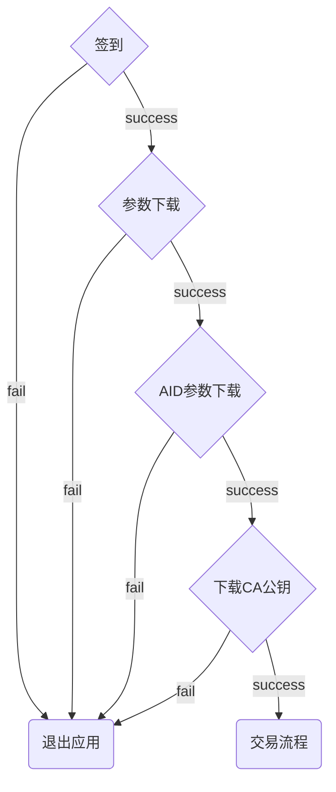
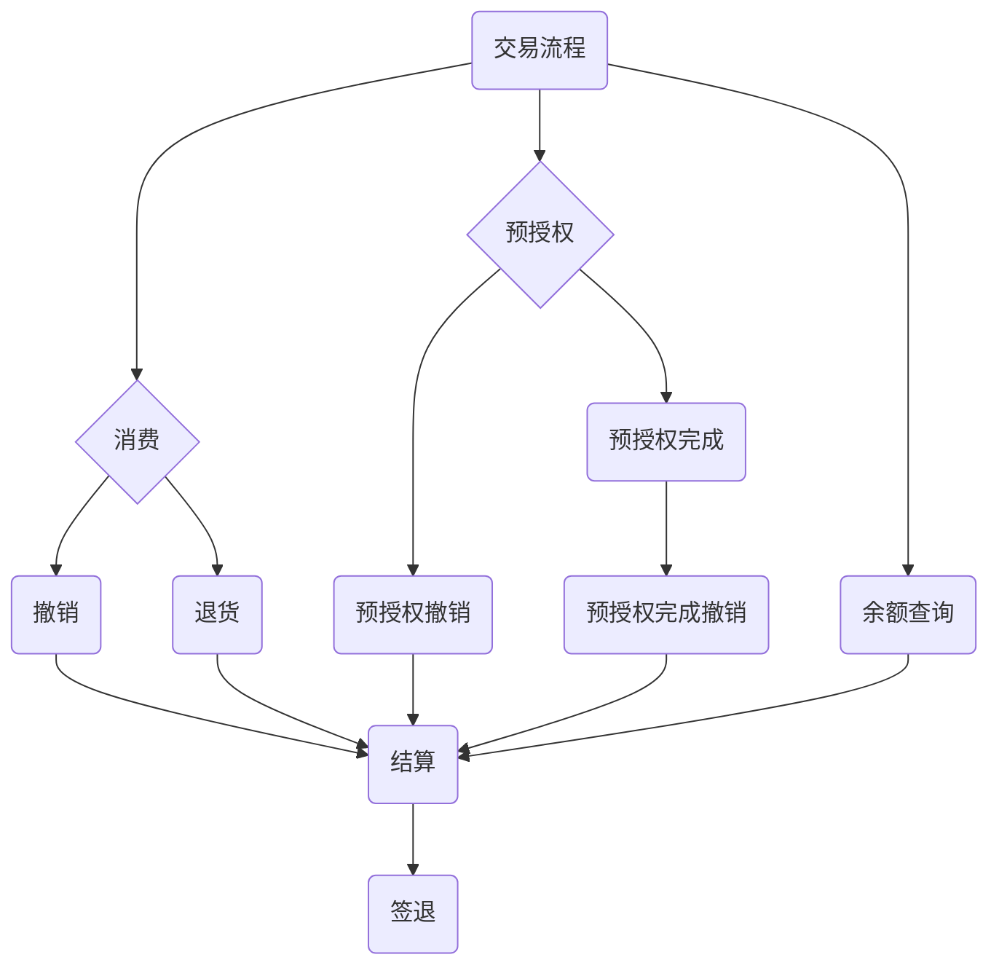
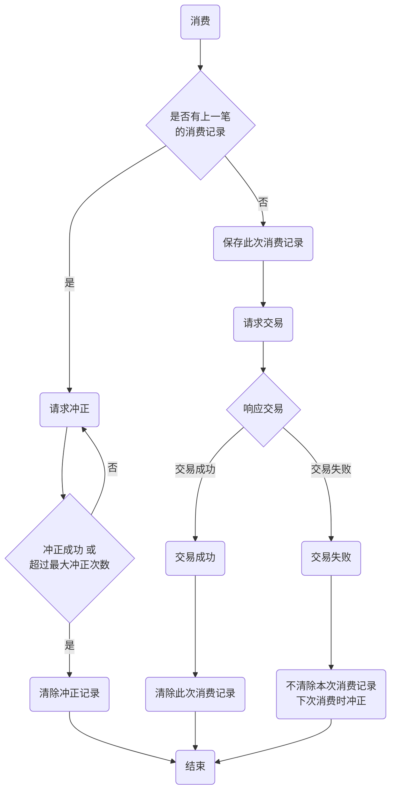

### 传统POS流程及名词解释

####  签到流程

POS机签到只要有两个目的：

1. 链接主机证明该POS机设备是合法的
2. 下载最新的工作密钥

签到就是POS设备向服务器发起签到请求，然后让服务器返回三个工作密钥，分别用于加密POS传输给服务器的银行卡的三个信息。三个工作密钥是通过POS设备硬件芯片内的密钥（在服务器端也有）进行加密的。

#### 交易流程

交易流程是在签到成功之后才能进行，交易流程包括正常消费/预授权流程/余额查询。

名称解释：

1. 消费：

   包括正常刷卡/挥卡/插卡消费

2. 消费撤销：

   因为某种原因已经进行过消费的一笔交易，请求撤销。需要注意的是，**消费撤销必须是撤销消费所用POS机的当日当批次的消费交易**。

3. 消费退货：

   和消费撤销类似，退货也是对一笔消费交易进行退款。不同的是

   - 退货不要求当日当批次的消费
   - 退货一般支持部分退货，多次退货，而消费撤销一般都是直接退全款

4. 结算：

   一般POS机在每天的工作结束之后，应进行结算操作（分为手动结算和自动结算）结算会将当日POS机中存储的所有笔交易（包含消费、消费撤销）上传至后台并清空，然后进行签退。一个结算周期内所有的交易使用的是同一个批次号，即同一批次。因此可以简单的理解为结算之前只能消费撤销，因为消费数据在POS机里面存着；结算之后只能退货，此时原消费数据已从POS机里面清除。

5. 预授权：

   就是商户通过POS机申请的方式向发卡行申请冻结持卡人借记卡或贷记卡中一部分金额或额度作为抵押的一种交易，也可以解释为商户在客户的授权下向发卡行申请的在一定时限、一定金额内扣收一笔客户款项的许可，这个款项的许可呈现，就是欠账单上的授权码。理解预授权要注意一下几点

   - 预授权不是扣款，并没有产生实际交易，只是这部分钱在商户进一步处理前，客户无法去操作而已
   - 必须验证客户卡片的有效性，包括卡号、有效期、发卡行、客户签名、密码
   - 预授权的小票需要客户签名
   - 必须注意保存预授权单据，因为在预授权完成时要求必须输入预授权号，预授权日期等信息，否则预授权完成交易无法成功完成，商户无法收到结算资金。
   - 预授权有效期一般为30天（含），超过时间资金将自动解冻。
   - 交易凭证上标有“预授权”字样。

6. 预授权撤销：

   预授权以后如果想取消怎么办？一是等30天后预授权自动取消，二就是做预授权撤销，预授权撤销是只商户未进行预授权完成前，客户不想使用这张卡进行消费时商家进行的操作。

7. 预授权完成：

   是指特约商户对已取得预授权的交易，在预授权金额或超出预授权金额一定比例范围内，通过POS终端或手工方式完成持卡人付款的过程，因为在预授权是客户已经输入过密码了，表示商家可处理预授权的资金，所以预授权完成时无需输入密码。预授权是可以超额扣款的，最大扣款金额是预授权金额的115%。

8. 预授权完成撤销：

   预授权完成撤销，是指商户已经进行预授权完成，但是发现完成金额与实际消费金额不符时进行的操作，预授权完成撤销会取消预授权完成的凭证，把预授权恢复到初始状态，注意，预授权完成撤销后是可以再次发起预授权完成的，并且整个过程无需客户再次输密。

#### 消费冲正流程

名次解释：

1. 冲正

   当POS机终端将一笔交易的报文发往后台，但是没有收到返回最终超时时，POS机无法确定后台是否成功的完成了这笔交易。因此，当下笔交易发生前，POS机会先向后台请求撤销该笔不确定的交易，如果后台记录该笔交易成功，则回滚及撤销该笔交易，否则不处理，此为冲正成功；如果POS机与银联结算中间在数据传输过程中发生故障，则冲正不成功，此时刷卡方卡里的钱已经被扣，需要进行人工冲正。

